# IIITNR Attendance System - Android Version (Student)

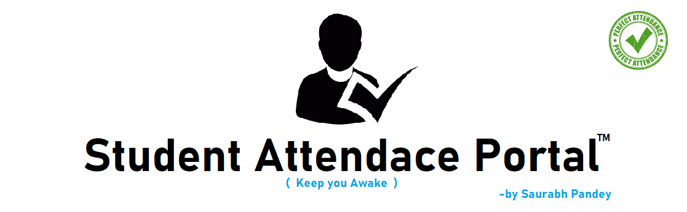

<a href="">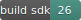</a>

<a href="Attendance%20System%20Handover%20Doc%20and%20Appliation/Student%20Application.apk" target="_blank">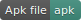<a>
<a href="LICENSE" target="_blank"><a>
 

## About
Attendance Management System is a software developed for daily student attendance in schools, colleges and institutes. The purpose of developing attendance management system is to computerize the tradition way of taking attendance. This Android-app will help the student to get information about the current status of their Attendace ,anytime they want.This is important for university students because of minimum 75 % attendance criteria.

## Features
- **Realtime-synchronization** with database.
- **Notification alert** if attendace below threshold. 
- Student can **View & analyse attendance details**, anytime you want.
- Faculty can **Autogenerate the Excel Sheet** corresponding to the attendance report of the students.

## Security 
- Login details and device id verification to avoid fraud and Spamming.
- device block if unusual activity detected.
- Allows single device login per id at time.
- End-to-End encryption.

# Screenshots #

|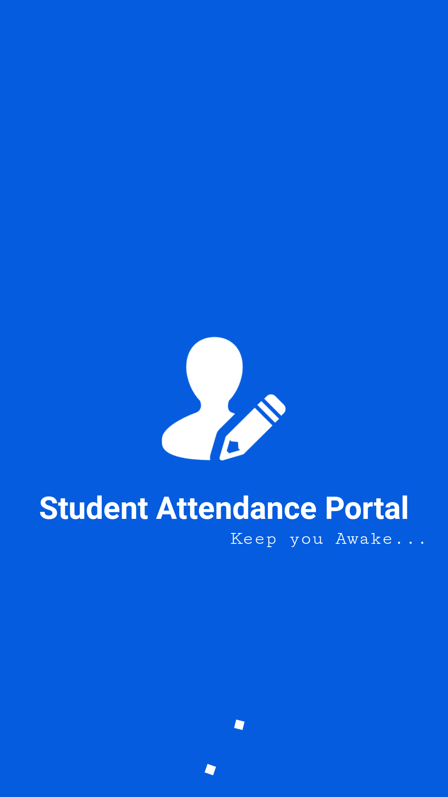|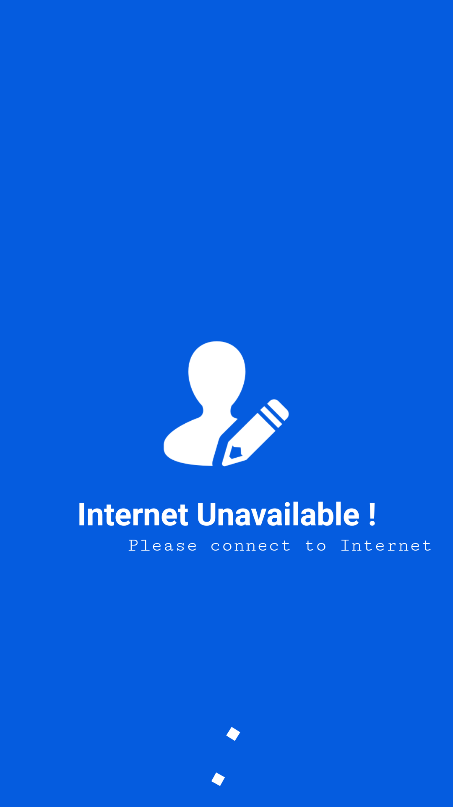|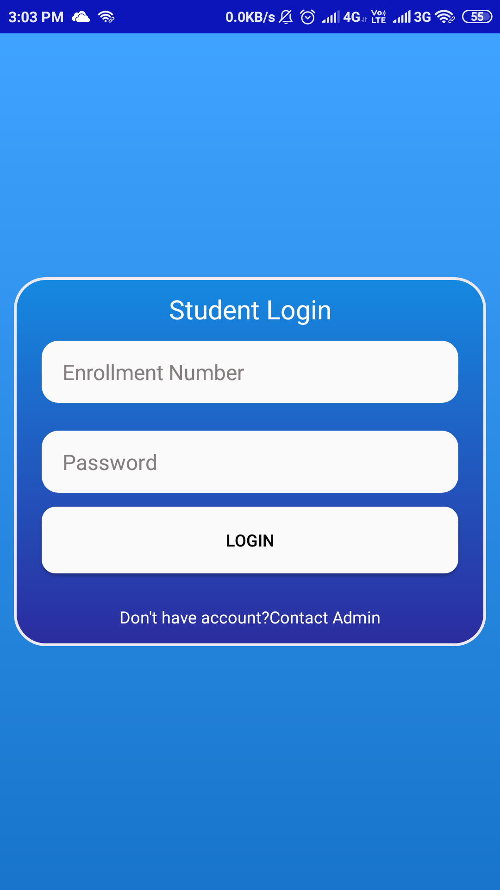|
|:--:|:--:|:--:|
|**Splashscreen**|**Internet Check**|**Login**|

|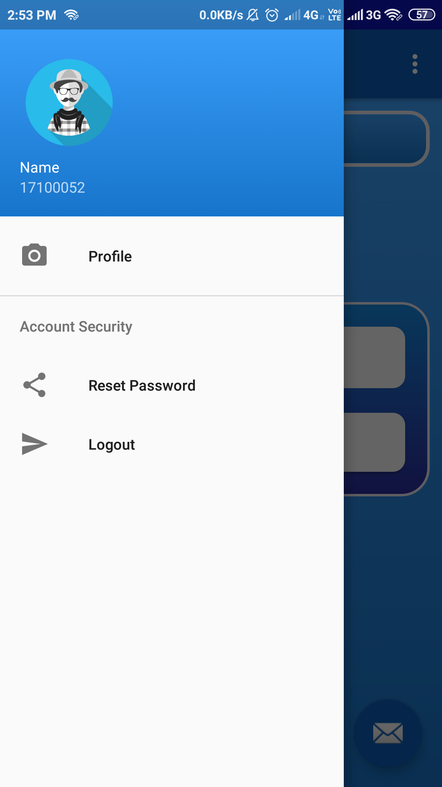|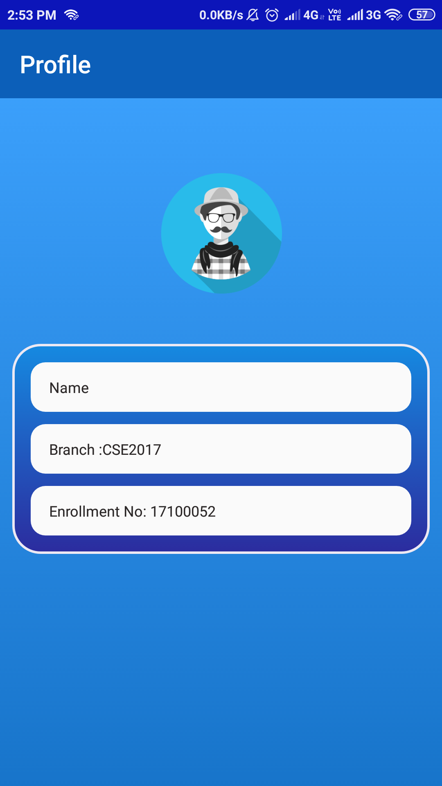|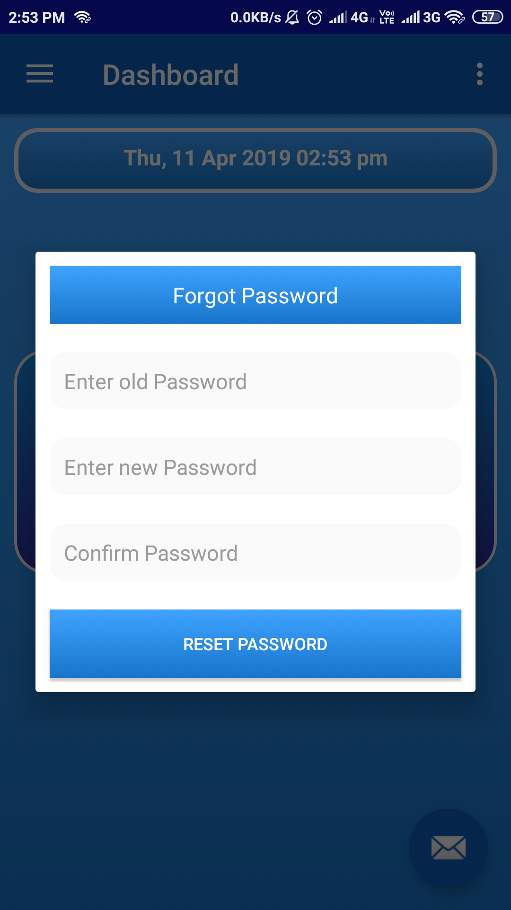|
|:--:|:--:|:--:|
|**Navigation drawer**|**Profile Section**|**Change Password**|

|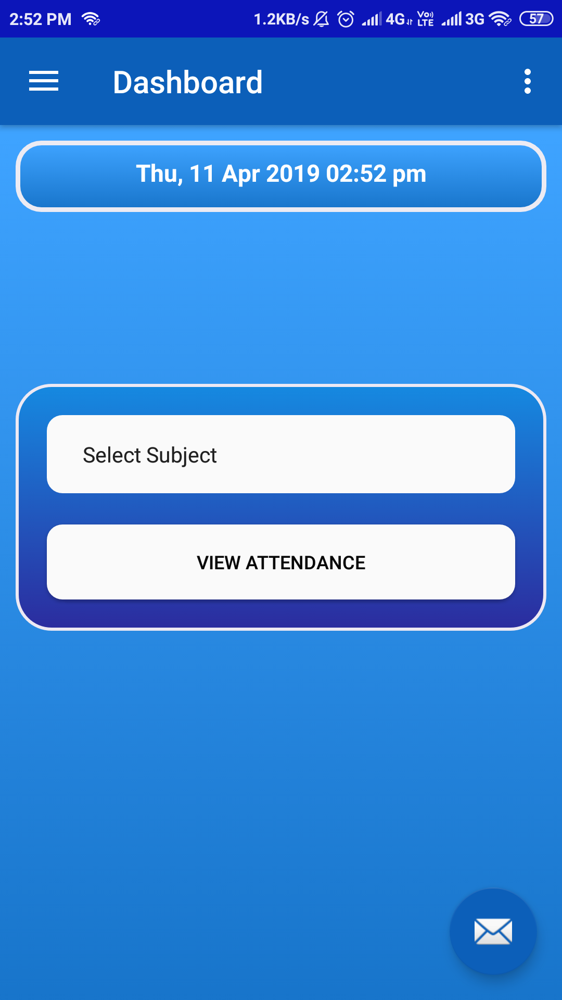|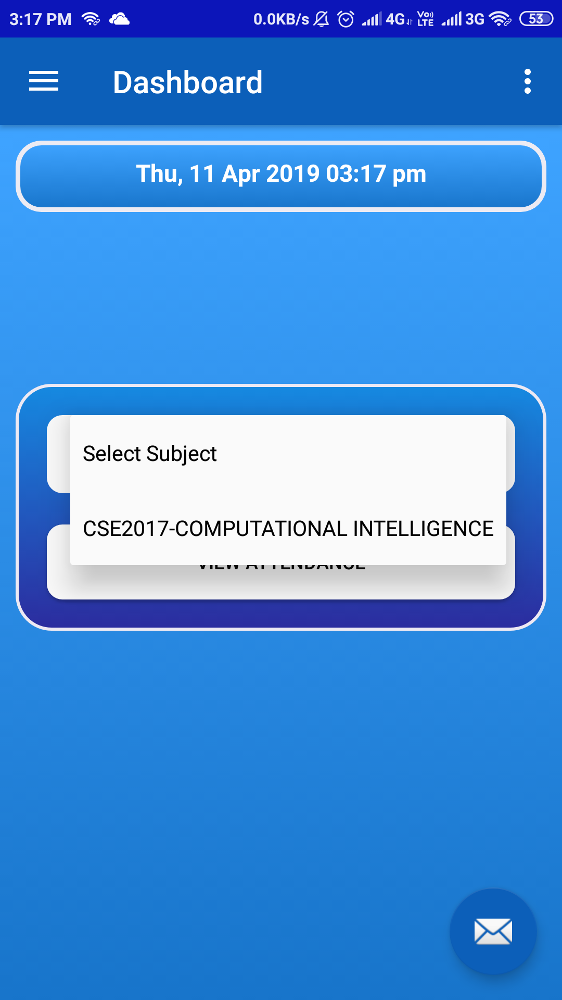|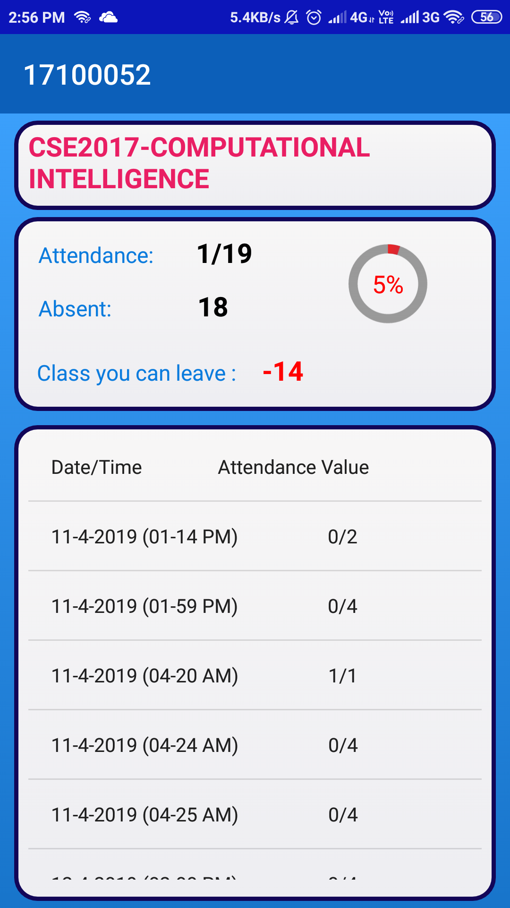|
|:--:|:--:|:--:|
|**Dashboard**|**Select Enrolled subjects**|**Attendace Record with all required details**|

## Tools Used
* [Android Studio](https://developer.android.com/studio) : Used as the Android developement environment.
* [Firebase Realtime Database](https://firebase.google.com/products/realtime-database) : Used as the backend database.
* [Firebase Storage](https://firebase.google.com/products/storage) : Use to store product Image
* [Firebase Authentication](https://firebase.google.com/products/auth) : Used to manage User information

## Future Possibilities and Extension of this project
- biometric can be implemented and integrate using device like **Raspberry Pi**.
- Online assignment submission.
- Resource sharing & study material.
- group discussion and doubt clearing.

## Author 
**Thanks for going through this Repository! Have a nice day.** 
 **Saurabh Roy** 
#### **Contact** :`roysaurabh1308@gmail.com`

## License
This Project is licensed under the MIT License, see the [LICENSE](LICENSE) file for details.
 
 

